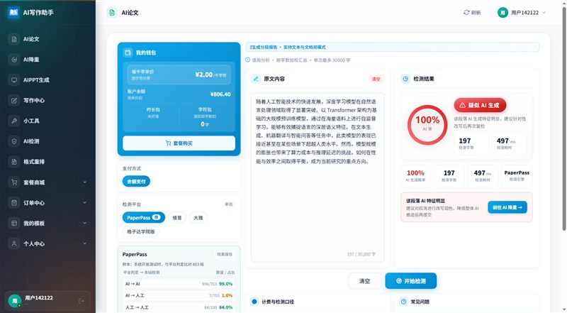
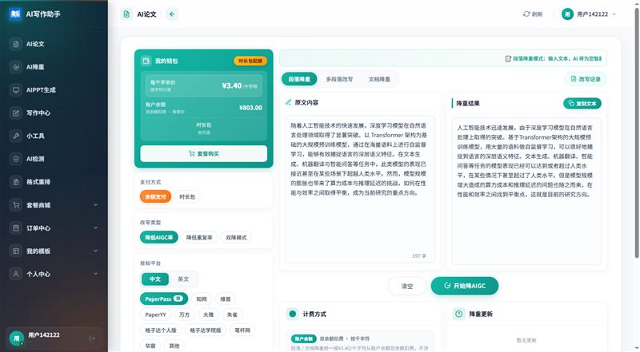
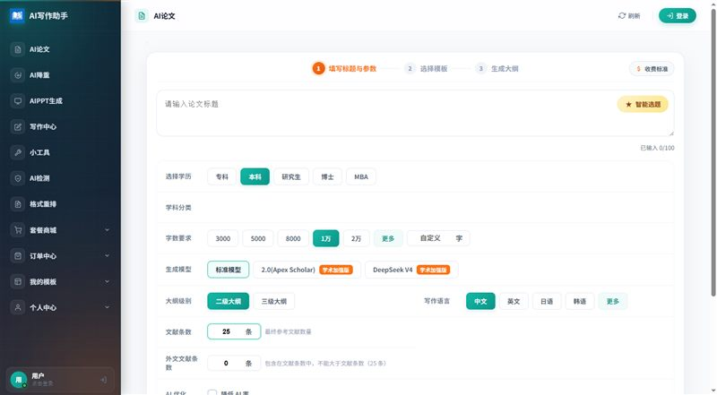

# 论文降 AI 率 · AIGC 降重 · AI 率检测 —— 多平台一站式指南

> 毕业论文 / 期刊投稿的 AI 痕迹完整处理方案：**多平台 AI 率检测 → 一键 AIGC 降重 → 降后复查**，一个入口全流程闭环。

## 真实效果预览（实测截图）

<div align="center">

**AI 率检测 · 多平台一键实测**（AI 率圆环 + 判 AI 片段明细）



**AIGC 降重 · 降后立即复查**



**PC 端平台全貌**



</div>

---

## 你是不是正在遇到这些问题

- 学校用**格子达 / 维普 / 大雅 / PaperPass** 送检，自己先测一下心里有底
- 论文 AI 率 **60%、80%**，学校要求降到 **20% 以下**，不知道从哪下手
- 网上工具降完**语句不通、格式全乱**，改回来又降不下去
- 降完不知道**降到多少了**，反复花钱检测、反复返工

---

## 一站式处理流程

```
多平台检测（摸清 AI 率 / 重复率）→ AIGC 降重（多引擎任选）→ 降后复查（闭环验证）→ 出报告
```

## 三大核心能力

### 1. AI 率检测

| 能力 | 说明 |
|---|---|
| 多平台任选 | **PaperPass、维普、大雅、格子达**（随上游持续扩展） |
| 判定口径 | 检测结果与平台官方判定一致率高，避免"自测过了、送检翻车" |
| 报告明细 | 精确到段落级，哪些片段被判 AI 一目了然 |

**检测判定一致率**（系统检测结果与平台官方判定一致的比率，开发期间实测）：

| 平台 | 比对样本 | 检测判定一致率 |
|---|---|---|
| PaperPass | 803 段 | **97.14%** |
| 大雅 | 746 段 | **94.91%** |
| 格子达 | 991 段 | **94.05%** |
| 维普 | 42,159 句 | **89.68%** |

> 数据为开发期间与平台官方判定比对的统计结果，仅供参考。

### 2. AIGC 降重（降 AI 率）

| 场景 | 支持平台 |
|---|---|
| 中文降 AI | **PaperPass、知网、维普、万方、大雅、朱雀、PaperYY、格子达个人版 / 学院版、笔杆网、华宸** |
| 英文降 AI | **Turnitin、ZeroGPT、知网、维普、格子达** |
| 闭环验证 | 降完立即复查，不用来回换工具拼流程 |

### 3. 传统重复率降重

| 场景 | 说明 |
|---|---|
| 支持平台 | **PaperPass、PaperYY 等**，全科目中文 / 英文论文覆盖 |
| 智能保护 | 改写保留原意，公式、参考文献、图表标题自动保护 |

---

## 两种使用方式

### 方式一：在线服务（注册即用，零部署）

👉 **[www.adhelp.cn](https://www.adhelp.cn)**

- **工厂价直供**：上游能力一手价，无中间商加价
- **保障明确**：AI 率检测与官方口径对比，误差大于 10 个点可全额退款
- PC 端 / 手机 H5 双端可用，微信扫码即可登录

### 方式二：自己搭一个站（全源码开源，做自己的生意）

如果你自己也想承接论文检测 / 降重业务，可以直接部署开源自建站系统 **lunwen-station**：

- 填入上游 API 凭证，**5 分钟开一个能收钱的 AI 论文站**
- **价格权 100% 自定义**：进价 + 加价全自动计费，差价全归你
- **货款直达自己的账户**：用户充值直接进你自己的微信 / 支付宝商户号，钱不过第三方平台，无需提现、无抽成
- 支持多平台检测、降重、AI 论文写作全能力对接

📦 开源仓库地址：

- GitHub：**https://github.com/bitequan/lunwen-station**
- Gitee 镜像：**https://gitee.com/jia-shouquan/lunwen-station**

---

## 常见问题

**Q：自己检测的 AI 率和学校一致吗？**
检测引擎与平台官方判定口径一致率高，但不同学校送检平台不同，建议按学校指定平台选对应检测项。

**Q：降重会破坏原意或格式吗？**
引擎以语义级改写为主，保留专业术语与论证逻辑；公式、参考文献、图表标题等自动保护。

**Q：降完能直接送检吗？**
建议降后用同平台复查一遍确认达标再送检，平台内检测→降重→复查可一站完成。

**Q：没有技术基础，能自己搭站吗？**
开源仓库提供完整部署文档与安装数据，准备好服务器与域名即可按文档逐步部署；对接凭证可在 [www.adhelp.cn](https://www.adhelp.cn) 获取。

---

*本仓库为服务指南与开源项目入口，业务能力由对接的上游平台提供。*
